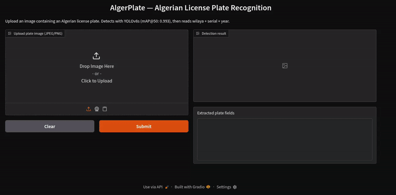
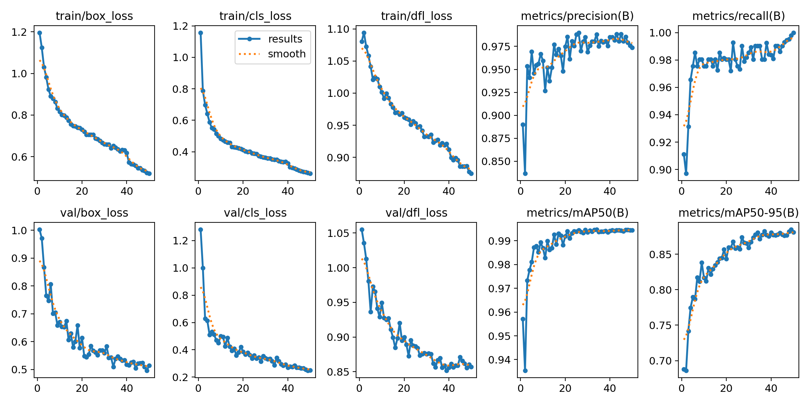

# AlgerPlate

[](https://huggingface.co/spaces/tobni/algerplate)
[](https://huggingface.co/datasets/tobni/algerian-license-plates)
[]()
[]()

**Live demo:** https://tobni-algerplate.hf.space



---


## Results

| Metric | Val set | Test set |
|--------|---------|----------|
| mAP@50 | 0.994    | 0.993    |
| Precision | 0.973 | 0.984    |
| Recall | 1.000    | 0.975     |




## API Quick Start

```bash
# Start the API
docker compose up

# Send a plate image
curl -X POST http://localhost:8000/detect \
  -F "file=@plate.jpg" | python3 -m json.tool
```

Expected response:
```json
{
  "plates": [{
    "wilaya": "16",
    "serial": "123456",
    "year": "2018",
    "vehicule_type": "1",
    "raw_text": "12345611816",
    "seg_confidence": 0.89,
    "det_conf": 0.97,
    "confidence": 0.87,
    "parse_success": true,
    "error_msg": "",
    "latency_ms": 420.5
  }],
  "total_latency_ms": 420.5,
  "plate_count": 1
}
```